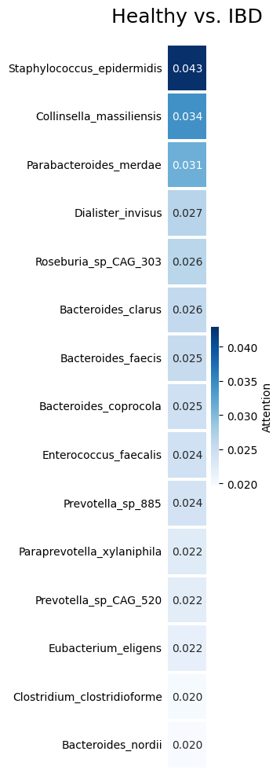
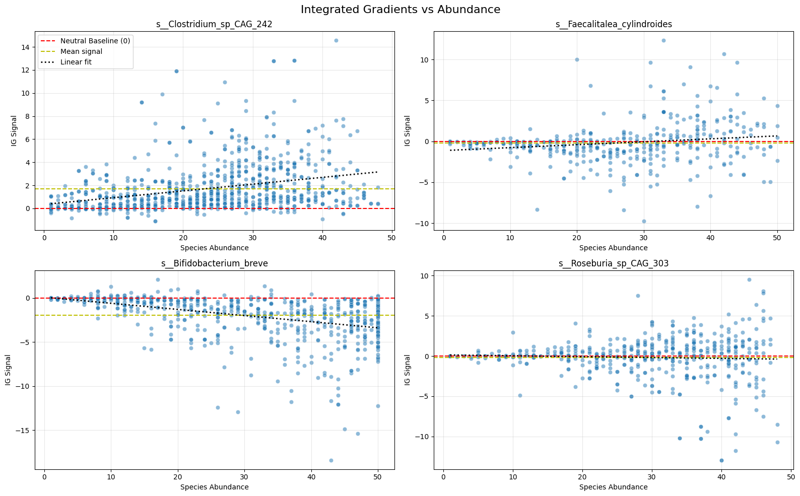
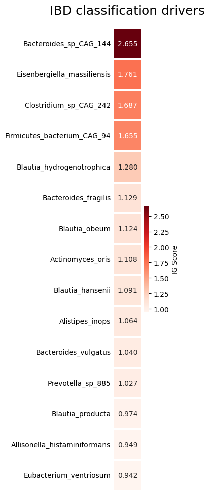
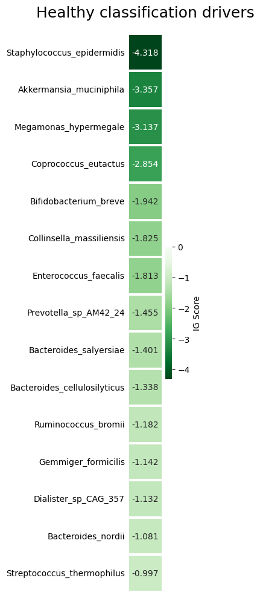

# Beyond Attention: Signed Integrated Gradients Attribution in a BiomeGPT-Style Microbiome Transformer

[](https://arxiv.org/abs/2608.06486)

This is the code for the paper **[Beyond Attention: Signed Integrated Gradients Attribution in a BiomeGPT-Style Microbiome Transformer](https://arxiv.org/abs/2608.06486)** (Oren Nelson, 2026).

## Overview

BiomeGPT-style microbiome transformers are *feature-tokenized*. Each input token fuses two sources: a fixed **species identity** embedding and a variable **abundance** embedding. People usually interpret these models by reading attention weights, and the paper argues that this has two limitations:

1. **Attention weights are non-negative.** They can't tell a disease-promoting signal apart from a health-supporting one.
2. **Attention acts after the sources are fused.** It can't say whether a token mattered because of *which* species it is or *how abundant* it is.

The paper uses **Integrated Gradients (IG)** with a **source-derived baseline**. The species identity embedding stays fixed, and only the abundance embedding moves toward an absent-species (bin 0) baseline. The target is the log-odds `logit(IBD) − logit(healthy)`, so the attributions are **signed**: positive values push a prediction toward disease and negative values push it toward health. Applied to IBD-versus-healthy classification, this separates pathogenic microbial signals from protective ones, and it shows species–abundance sensitivity patterns that unsigned attention misses. The paper also recommends second-order **Integrated Hessians** for studying how species in a community interact. The method works for any smooth, differentiable feature-tokenized transformer.

## Repository contents

```
src/token_source_attributor/
├── models/biomgpt.py          # BiomeGPT-style encoder: token = LN(species_emb) + LN(abundance_mlp(bin))
│                              #   + masked-abundance pretraining head and sequence-classification head
├── data/
│   ├── fetch_stool_species.R          # pulls MetaPhlAn stool profiles from curatedMetagenomicData (pretraining)
│   ├── fetch_classification_data.R    # IBD vs. healthy stool samples aligned to the pretraining vocab
│   ├── data_preprocessing.py          # per-sample rank binning of relative abundance into 50 bins
│   ├── dataset.py                     # PyTorch datasets
│   ├── species_vocab.txt              # 1,661-species MetaPhlAn vocabulary
│   └── *_binned.tsv                   # binned pretraining (~28K samples) and classification (~7.5K) matrices
├── training/
│   ├── pretrain_biomgpt.py    # masked nonzero-abundance modeling (foundation model)
│   ├── classifier_biomgpt.py  # fine-tune IBD vs. healthy classifier from pretrained backbone
│   └── baseline.py            # predict-the-mean MSE baseline for pretraining
├── inference/classify.py      # batch classification metrics
├── attribution/
│   ├── IG.py                  # signed, source-separated Integrated Gradients (Captum)
│   ├── saliency.py            # gradient saliency per source
│   └── inputs.py              # abundance embedding vs. baseline diagnostics
└── visualization/ig_jsonl.py  # HTML token-level attribution dashboards
tests/                         # unit tests and attribution runs (pytest)
visualizations.ipynb           # figures from the paper
*.png                          # exported figures
```

### How the attribution works

`attribution/IG.py` breaks the model's forward pass apart at the source embeddings:

1. `backbone.build_source_embeddings` returns separate species and abundance embeddings, and these become the IG inputs.
2. `backbone.forward_from_components` composes them (`LN(species) + LN(abundance)`) and runs the encoder.
3. IG integrates from the baseline `(species_emb, abundance_emb(bin=0))` to the input. Because the species embedding is identical at both ends, its attribution is zero by construction and all of the signal goes to abundance.
4. Attributions are summed over the hidden dimension, which gives a signed per-species score `[B, S]`. The script also returns the [CLS] attention averaged over layers and heads, so the two can be compared directly.

## Installation

```bash
python3 -m venv .venv
source .venv/bin/activate
pip install -e ".[dev]"
pip install torch torchvision torchaudio --index-url https://download.pytorch.org/whl/cu126
```

## Reproducing the paper

### 1. Data

The data is MetaPhlAn shotgun metagenomic profiles from the [curatedMetagenomicData](https://github.com/waldronlab/curatedMetagenomicDataTerminal) R package. The binned matrices are already in `src/token_source_attributor/data/`. To regenerate them from scratch:

```bash
Rscript src/token_source_attributor/data/fetch_stool_species.R
```

```bash
Rscript src/token_source_attributor/data/fetch_classification_data.R
```

```bash
python src/token_source_attributor/data/data_preprocessing.py
```

### 2. Pretrain the backbone (masked abundance modeling)

```bash
python -m token_source_attributor.training.pretrain_biomgpt
```

This saves checkpoints to `checkpoints/`. The classifier loads `checkpoints/biomgpt_pretrain_epoch_20.pt`.

### 3. Fine-tune the IBD vs. healthy classifier

```bash
python -m token_source_attributor.training.classifier_biomgpt
```

This saves the best checkpoint to `checkpoints_classifier/biomgpt_classify_best.pt`.

### 4. Run attribution and make figures

```bash
pytest tests/test_IG.py -s
```

Then open `visualizations.ipynb` to reproduce the attention-vs-IG comparisons, the per-species driver plots, and the abundance-sensitivity plots.

## Selected figures

| Attention ([CLS], unsigned) | Signed IG vs. abundance |
|---|---|
|  |  |

| Top IBD-driving species | Top health-driving species |
|---|---|
|  |  |

## Model reference

The architecture and training setup follow BiomeGPT ([bioRxiv 2026.01.05.697599](https://www.biorxiv.org/content/10.64898/2026.01.05.697599v1.full.pdf)). It is an 8-layer, 8-head, d=512 BERT-style encoder over 1,661 species tokens with 50 rank-based abundance bins, pretrained by masking nonzero abundances and then fine-tuned with a [CLS] classification head.

## Citation

```bibtex
@article{nelson2026beyondattention,
  title   = {Beyond Attention: Signed Integrated Gradients Attribution in a BiomeGPT-Style Microbiome Transformer},
  author  = {Nelson, Oren},
  journal = {arXiv preprint arXiv:2608.06486},
  year    = {2026}
}
```

## License

See [LICENSE](LICENSE).
